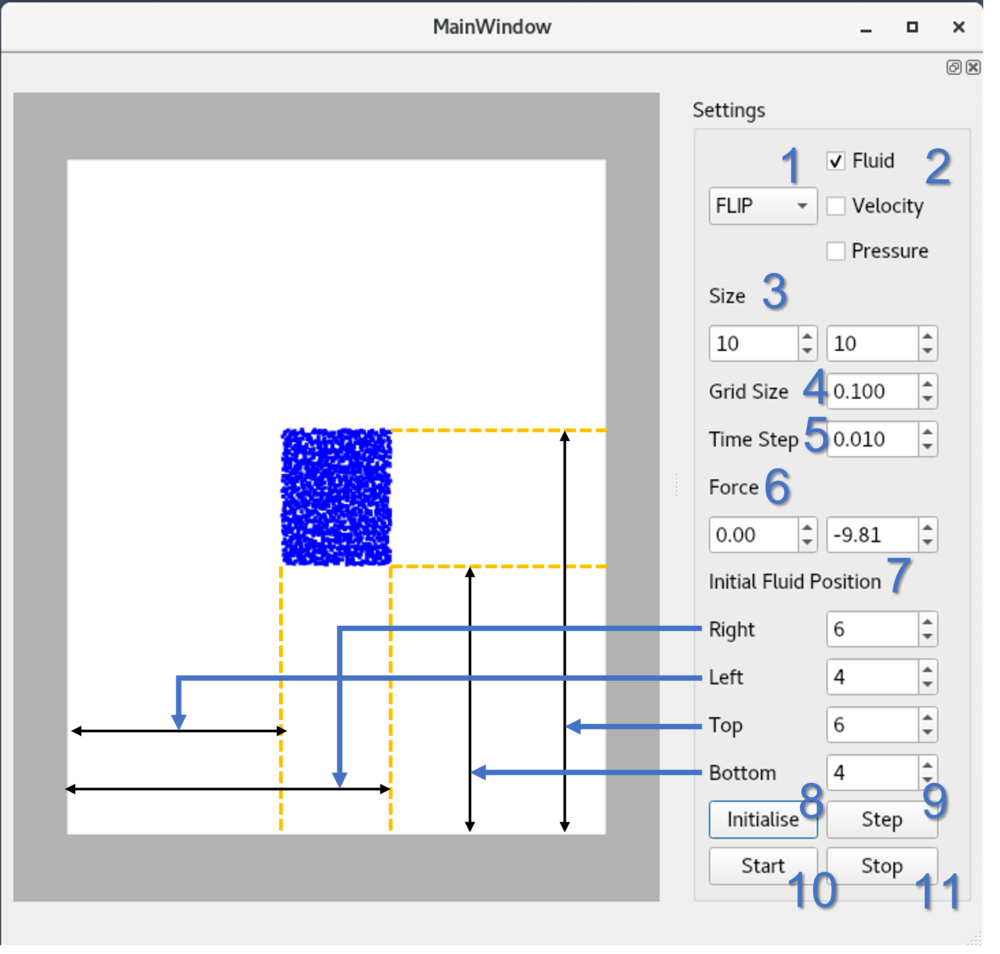
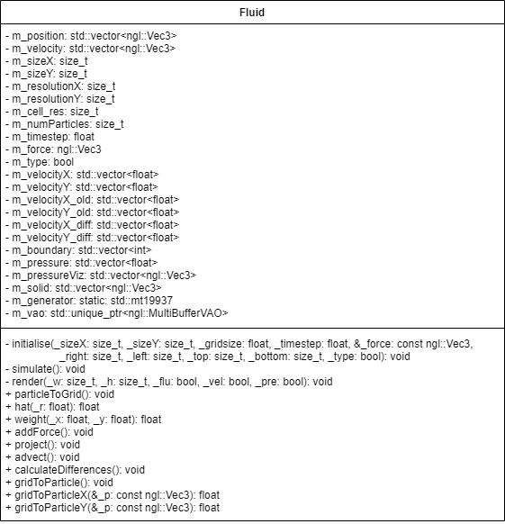
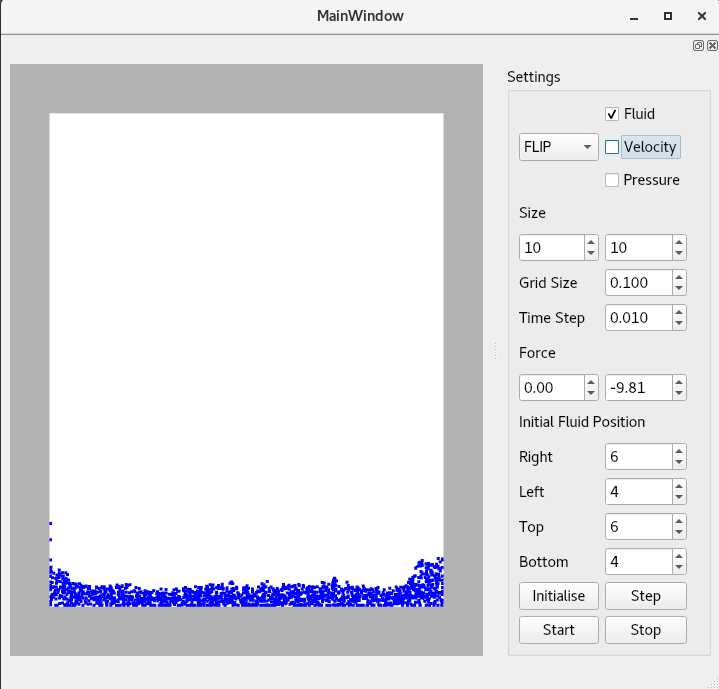
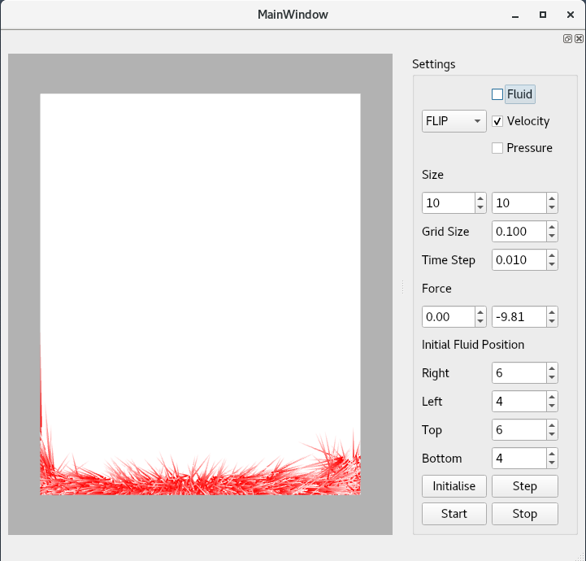
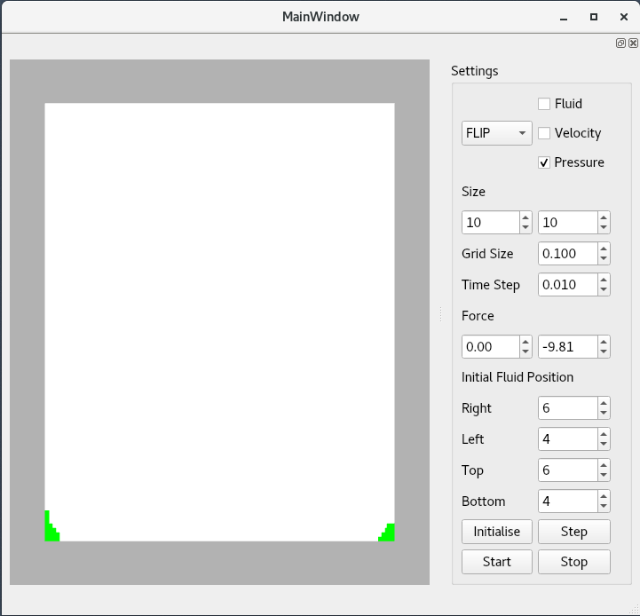

# FluidSimulation

https://user-images.githubusercontent.com/72556403/160213079-3978c050-bb7e-4152-8a88-d0d7cd4923ff.mp4

2D fluid simulation using FLIP and PIC, implemented in C++ with [NGL](https://github.com/NCCA/NGL).

## Table of Contents

- [Build Instructions](#build-instructions)
- [User Guide](#user-guide)
- [Implementation Details](#implementation-details)

## Build Instructions
To build the project we use cmake, ensure the following libraries are installed

- NGL
- Eigen

```
cd ../FluidSimulationGUI
mkdir build
cd build
cmake ..
make
```

## User Guide

User can change the simulation settings via GUI as follows:



1. Solver - Choose a solver from PIC and FLIP.
2. Flags - Visualisation flags to visualise fluid particles, velocity vectors and pressures in the cells.
3. Size - The size of the simulation.
4. Grid Size - The size of each cell. It will be converted to the nearest value that can divide the 1x1 grid evenly.
5. Time Step - The time step of the simulation.
6. Force - External forces that affect the fluid particle movements.
7. Initial Fluid Position - The positions where the fluid particles are initialised. Right sets the right side, Left sets the left side, Top sets the top side and Bottom sets the bottom side of the initial fluid. The input values outside the simulation frame are pushed back to the edges of the frame. When Left is greater or equal to Right or Bottom is greater or equal to Top, no particle is initialised.
8. Initialise - Sets the values in the GUI to the simulation.
9. Step - Simulate one time step.
10. Start - Start the simulation.
11. Stop - Stop the simulation.

## Implementation Details

Background research, basic algorithms and implementation for this project can be found in my [CGIT Techniques Report](docs/CGI_Techniques_Report.pdf). The details of the implementation are described below. The equations mentioned in the descriptions are referred from the report.

### Class Diagram

<p align="center">
    
</p>

This class diagram only includes the class used for simulation. Other classes in the program were used for visualisation.

### Algorithm

#### Overview

1. Initialise the simulation.
2. For each time step,
    1. Interpolate the particle velocities to velocity fields on the grid.
    2. Add force to velocity fields.
    3. Compute the pressure field and update the velocity fields.
    4. Calculate the velocity changes on the grid (FLIP only).
    5. Interpolate the velocities on the grid to particles.
    6. Move particles.


#### 1. Initialise

Initialise all the variables and vectors used for simulation by the *initialise* function.
The simulation frame is split into small cells and 4 particles are randomly initialised in each fluid cell.
The position of the particles are stored in the *m_position* vector and velocities are stored in the *m_velocity* vector. The particle velocities are set to 0 initially.
Each cell is marked as solid (-1), air (0), and fluid (1) using the *m_boundary* vector.


#### 2.1 Particle to Grid

Velocities are transferred from particles to velocity fields on the MAC grid by the *particleToGrid* function. The velocities in the x direction are stored in the *m_velocityX* and the velocities in the y direction are stored in the *m_velocityY*.
The interpolation of the velocities is done by using the equations 8, 9 and 10. The calculation uses the hat function introduced in my report (Equation 9 and 10). The *weight* function calculates the equation 9 and the *hat* function calculates the equation 10.

After looping through all the particles, loop through the velocities on the grid and calculate the velocities by dividing the top part by the bottom part.

The calculated velocities are stored in *m_velocity_oldX* and *m_velocity_oldY* to calculate the velocity changes later for FLIP simulation.


#### 2.2. External force

External forces are simply added using the Euler method (Equation 11) by the *addForce* function.

The velocities on the solid surfaces are set to 0 before computing the pressure field.


#### 2.3. Projection

Pressures are calculated and velocity fields are updated in the *project* function.

The conjugate gradient solver in the [Eigen library](https://eigen.tuxfamily.org/dox/classEigen_1_1ConjugateGradient.html) is used for pressure computation.

First, calculate the coefficients for *p* in the equation 16 and divergences for each cell and store them in the matrix *A* and vector *b* respectively. Coefficients are set to -1 for fluid neighbours and 4-(number of non-solid neighbours) to the cell.
Divergences are calculated using the equation 15.

Then, pressures are calculated using the conjugate gradient and stored in the *m_pressure* vector.

After the pressure calculation, velocity fields are updated using the equation 12.


#### 2.4. Calculate the velocity changes (FLIP only)

FLIP uses the velocity changes on the grid to update the particle velocities. Therefore, the changes are calculated by the *calculateDifferences* function.


#### 2.5. Grid to particle

Velocities are transferred from the velocity fields on the grid to particles by the *gridToParticle* function. This function loop through each particle and interpolate the velocities in the x direction and y direction separately using the *gridToParticleX* and *gridToParticleY* functions. The interpolation of the velocities is done according to the equation 21.
The interpolated velocity changes are added to the particle velocities for FLIP. On the other hand, the particle velocities are replaced by interpolated velocities for PIC.


#### 2.6. Advection.

Finally, the particles are moved by the Euler forward method in the *advect* function.

After updating the particle positions, some particles can be outside the simulation frame due to a truncation error in the Euler forward method. These particles are pushed back to the frame.

After the advection, the *m_boundary* vector is updated according to the particle positions.

### Testing
The particles, velocity vectors and pressures are visualised in blue, red and green respectively as can be seen below.

<p align="center">
    
    
    
</p>
